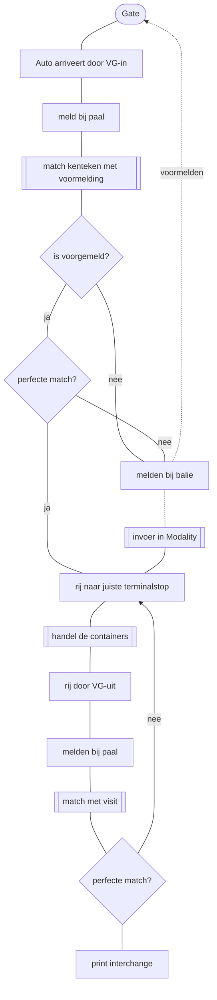

<!-- title: Visual Gate Project CTT-->
# 1. Visual Gate Project CTT
```code
Datum:      4-1-2021
Versie:     0.1
Bedrijf:    Combi Terminal Twente B.V.
Auteur:     D. J. Otter
```

# 2. Inhoudsopgave
- [1. Visual Gate Project CTT](#1-visual-gate-project-ctt)
- [2. Inhoudsopgave](#2-inhoudsopgave)
- [3. Project Omschrijving](#3-project-omschrijving)
- [4. Procedures](#4-procedures)
  - [4.1. CTT Rotterdam](#41-ctt-rotterdam)
    - [4.1.1. Truck](#411-truck)
      - [Voormelden](#voormelden)
    - [4.1.2. Barge](#412-barge)
    - [4.1.3. Rail](#413-rail)
  - [4.2. CTT Hengelo](#42-ctt-hengelo)
    - [4.2.1. Truck](#421-truck)
    - [4.2.2. Barge](#422-barge)
    - [4.2.3. Rail](#423-rail)
  - [4.3. CTT Almelo](#43-ctt-almelo)
    - [4.3.1. Truck](#431-truck)
    - [4.3.2. Barge](#432-barge)
    - [4.3.3. Rail](#433-rail)
- [5. Technisch ontwerp](#5-technisch-ontwerp)
  - [5.1. Modality pre-gate functionaliteit](#51-modality-pre-gate-functionaliteit)
  - [5.2. Modality gate functionaliteit](#52-modality-gate-functionaliteit)
  - [5.3. Modality API](#53-modality-api)
  - [5.4. Modality](#54-modality)
  - [5.5. Portbase voormelden](#55-portbase-voormelden)
  - [5.6. MCA-Portbase API](#56-mca-portbase-api)
  - [5.7. Sentors hardware](#57-sentors-hardware)
  - [5.8. Sentors API](#58-sentors-api)
- [6. Partners](#6-partners)
  - [6.1. Modality](#61-modality)
  - [6.2. Portbase](#62-portbase)
  - [6.3. Sentors](#63-sentors)
  - [6.4. Secure Logistics](#64-secure-logistics)
- [7. Appendix](#7-appendix)

# 3. Project Omschrijving
CTT wil graag voor haar terminals een nieuwe oplossing voor haar Visual Gate entries. Voor alle modaliteiten en voor alle CTT Terminal locaties moeten daadwerkelijke gatemoves gematched kunnen worden met voormeldingen die door partijen worden gedaan. Basis hiervoor is om de visuele zintuigen te vervangen door artificiële zintuigen (camera's).

De oplossing moet de mogelijkheid hebben om op termijn extra controles toe te voegen naast de normale size, nummer en kenteken controles die nu ook plaatsvinden op CTT Hengelo. Je moet dan denken aan controles op schade, ADR bestickering, etc.

# 4. Procedures
Voor de diverse CTT terminals gelden er specifieke regels. De technische aspecten van de functionele gate-procedures dienen te gelden voor alle locaties.
 
## 4.1. CTT Rotterdam
CTT Rotterdam heeft drie modaliteiten die door Visual Gate moeten worden afgehandeld.
### 4.1.1. Truck
#### Voormelden
Een auto moet zich voorgemeld kunnen worden via Portbase Road of via een alternatief via een website aangeboden door CTT/Modality.

### 4.1.2. Barge
### 4.1.3. Rail

## 4.2. CTT Hengelo
### 4.2.1. Truck
### 4.2.2. Barge
### 4.2.3. Rail
Geen railconnectie aanwezig, optie is niet van toepassing.

## 4.3. CTT Almelo
### 4.3.1. Truck
### 4.3.2. Barge
### 4.3.3. Rail
Geen railconnectie aanwezig, optie is niet van toepassing.

# 5. Technisch ontwerp
## 5.1. Modality pre-gate functionaliteit
## 5.2. Modality gate functionaliteit
## 5.3. Modality API
## 5.4. Modality 
## 5.5. Portbase voormelden
## 5.6. MCA-Portbase API
## 5.7. Sentors hardware
## 5.8. Sentors API

# 6. Partners

## 6.1. Modality

## 6.2. Portbase

## 6.3. Sentors

## 6.4. Secure Logistics

# 7. Appendix